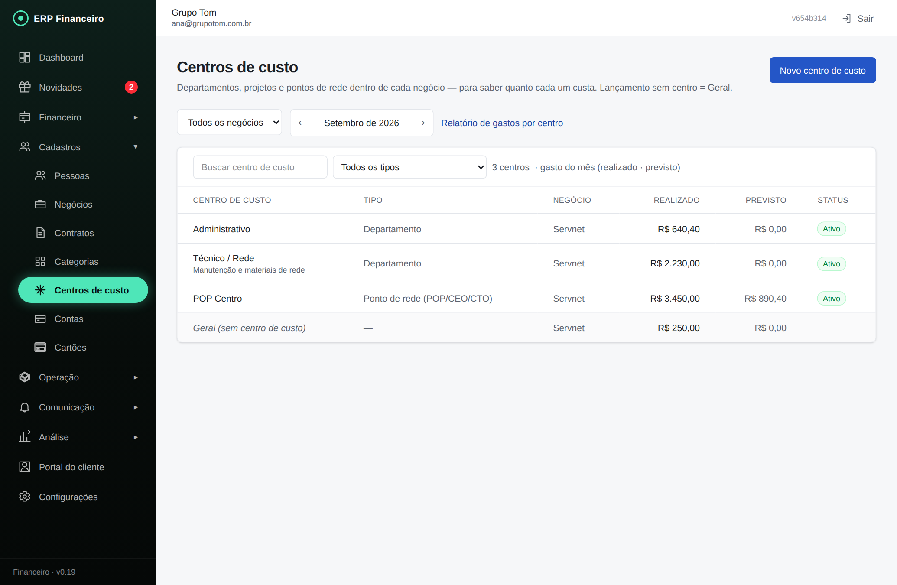
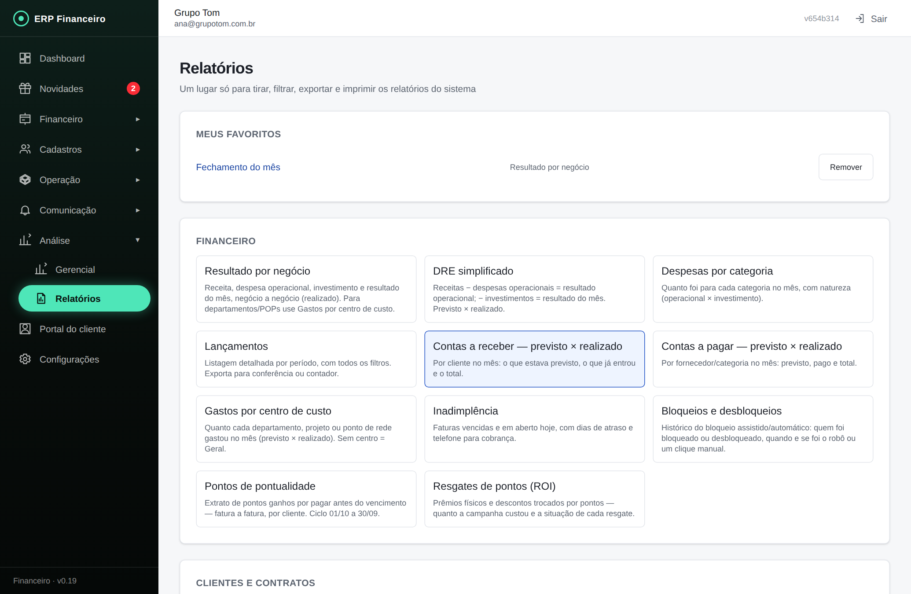
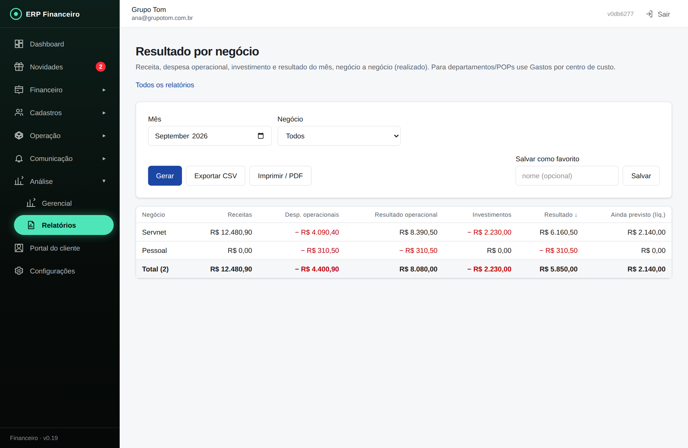

# Manual do Administrador — ERP Financeiro (Grupo Tom / Servnet)

Guia completo para um novo administrador operar o sistema, tela a tela. As imagens são de um ambiente de demonstração (os dados são fictícios). Endereço do sistema: o mesmo usado hoje no navegador (deploy do Cloudflare); funciona no computador e no celular.

> **No celular** as listas grandes (Lançamentos, Contas a pagar e a receber) viram **cartões** — um por linha, com data, descrição, valor e situação — em vez da tabela larga que exigiria rolar para o lado. As mesmas ações continuam ali (pagar, baixa parcial, cancelar, editar). As imagens deste manual são da versão de computador.

> **Filtros nas listas.** Toda lista grande tem a mesma barra no topo: **busca** por texto à esquerda, **filtros** (selects) ao lado e o **contador** ("12 de 240 itens") mostrando quanto sobrou. Os filtros se combinam e valem também para os indicadores e o CSV daquela tela — filtrou, o total e o arquivo exportado seguem o filtro. Onde a lista é por mês (Lançamentos, Contas, Conciliação, Centros de custo), o seletor de mês manda em tudo.
>
> Existem **três portas de entrada** diferentes:
> - **Administrador**: `/entrar` (e-mail e senha) — vê tudo.
> - **Técnico**: `/tecnico/entrar` (usuário e senha, sem e-mail) — vê só os chamados e a bolsa dele.
> - **Cliente**: `/portal/entrar` (CPF + data de nascimento) — vê só as coisas dele.

---

## Como o menu está organizado

O menu lateral agora tem 4 itens raiz e 4 grupos colapsáveis:

- **Dashboard** (raiz) — visão geral do mês.
- **Financeiro** (raiz) — lançamentos, cobrança, conciliação, fechamento.
- **Cadastros** — Pessoas, Negócios, Contratos, Categorias, Centros de custo, Contas, Cartões.
- **Operação** — Estoque, Compras, Ordens de Serviço, FTTH, Indicações.
- **Comunicação** — Notificações, Disparos, Apps.
- **Análise** — Gerencial (BI), Relatórios.
- **Portal do cliente** (raiz) — o que o cliente vê.
- **Configurações** (raiz).

Cada grupo expande/recolhe com um clique; o estado é lembrado no navegador. O grupo do módulo aberto expande sozinho.

## 1. Entrar no sistema

1. Abra o endereço do sistema e informe **e-mail e senha** do administrador.
> As três portas de entrada (administrador, técnico e cliente) têm o mesmo desenho: fundo escuro com faixas de luz e cartão de vidro — verde no ERP e na área do técnico, ciano no portal do cliente.

2. **Lembrar meu e-mail** guarda só o e-mail neste aparelho (a senha nunca é salva) — no próximo acesso você só digita a senha.
3. Esqueceu a senha? Digite o e-mail e clique em **Esqueci a senha**: chega um link para definir a senha nova. Abra o link **no mesmo navegador**.
4. **Sou técnico** e **Sou cliente** levam às outras duas portas de entrada sem precisar decorar endereço.
5. Por segurança, a sessão expira após 30 minutos sem uso.

## 2. Dashboard (visão geral)

É a primeira tela. Mostra, para o mês escolhido no canto superior direito:

- **Cartões do topo**: saldo total das contas, receitas/despesas do mês (realizado e previsto) e resultado. O "previsto" inclui a **projeção dos contratos** do mês exibido (mensalidades ainda não faturadas) — por isso um mês futuro já mostra a receita esperada.
- **Cobrança do período**: três anéis — Confirmadas (recebidas), A receber (no prazo) e Inadimplentes (vencidas, acumulado) — com filtro Dia · Semana · Mês e atalho para Contas a receber.
- **Avisos no WhatsApp**: se a régua de cobrança de cada negócio está em dia, com erro ou sem configuração.
- **Estoque**: itens zerados ou abaixo do mínimo; o link **Comprar** de cada item abre a Nova compra já com ele selecionado.
- **Resumo financeiro do período**: saldo inicial, previsto × realizado e resultado.
- **Saldo por conta** e **últimas movimentações**.

Use o seletor "Todos os negócios" para filtrar tudo por um negócio (ex.: só Servnet).

> **Dica — organizar o menu:** os itens do menu lateral podem ser **arrastados** para a ordem que você preferir (segure e solte no lugar desejado). A ordem fica salva no navegador; em outro computador o menu volta ao padrão até você reordenar lá também.

> **Dica — cartões do dashboard:** os cartões (Avisos no WhatsApp, Estoque, Resumo financeiro, Saldo por conta, Últimas movimentações) começam **recolhidos**: clique em qualquer lugar da linha do título para expandir ou recolher. A escolha de cada cartão também fica salva no navegador.

## 3. Financeiro

O menu Financeiro tem cinco abas: **Lançamentos**, **Contas a receber**, **Contas a pagar**, **Cobrança** e **Conciliação**.

### 3.1 Lançamentos

Todo o movimento do mês (receitas, despesas e transferências). Regras importantes:

- **Previsto** = ainda não aconteceu (conta a pagar/receber). **Efetivado** = dinheiro entrou/saiu de verdade.
- Para dar baixa: abra o lançamento → **Efetivar** → confirme a data e a conta (pode trocar a conta na hora da baixa; pagamento em atraso pode ter encargos).
- Lançamento pode ser **recorrente** (fixo ou parcelado): ao efetivar uma parcela, a próxima nasce sozinha.
- Despesa de **item físico** (roteador, ONU, cabo): marque **Entrada no estoque**, escolha o item (ou *+ Criar item no estoque*) e a quantidade — o item entra no estoque com esse custo, ligado ao lançamento, sem precisar ir ao Estoque. Comprou para um cliente específico? Vincule também ao **Contrato** dele (entra no custo/payback do cliente). Depois, na instalação, use Estoque → Instalação ou Comodato.
- **Quem é a pessoa na despesa:** é o **fornecedor** (quem vendeu), não o cliente — mesmo com o contrato vinculado. O cliente da compra é o campo **Contrato**, e é ele que leva o custo para o payback e para o relatório *Custo por cliente*. Em receita é o contrário: a pessoa vem do contrato e fica travada, porque quem paga é o cliente.
- **Desmarcar "Já pago" numa parcela:** abra a parcela, desmarque e salve — vale só para **aquela** parcela; o movimento sai da conta e ela volta a Previsto. As parcelas seguintes que já existiam continuam onde estavam.
- **Corrigir cadastro de uma compra parcelada:** abra qualquer parcela e troque **fornecedor, categoria, contrato, negócio ou centro de custo** — a correção vale para **todas as parcelas** da compra, inclusive as já pagas, porque esses dados são os mesmos do começo ao fim. Descrição, valor e observação continuam obedecendo à escolha "apenas esta / esta e as futuras / todas". A **conta** é a única que não muda por ali: ela mexe em saldo e em fatura de cartão já fechada.
- Parcelamento que já estava em andamento fora do sistema: informe o total contratado e **"Iniciar a partir da parcela"** (ex.: 24× começando na 2) — a numeração continua 2/24…24/24 e o resumo mostra o que foi pago fora e o que resta.
- Mensalidades de contrato entram sozinhas (faturamento automático); meses futuros aparecem como **projeção** (não são gravados).
- **Estornar**: efetivado errado (pago em duplicidade, valor errado) → abra o lançamento → **Estornar** (motivo obrigatório). Nasce um contra-lançamento de hoje devolvendo o valor; o original não muda — funciona até com o mês dele fechado. **Cancelar** é para quando o mês ainda está aberto e o lançamento nunca deveria ter existido.
- **Filtros**: tipo, status, negócio, **categoria**, **conta** e **centro de custo** (inclui "Geral (sem centro)"), mais a busca livre. Filtrar por centro esconde as projeções de contrato — elas não têm centro.
- **Fechar mês**: depois de conferir um mês passado com o extrato, clique em **🔒 Fechar mês** (ao lado do seletor). Nada efetivado dentro dele poderá ser alterado, cancelado ou excluído — cobranças em aberto continuam baixáveis (o dinheiro entra no mês atual). Para mexer no passado, use **reabrir** (fica auditado).

### 3.2 Contas a receber

Só as receitas previstas do mês, com atrasadas destacadas. Pesquise pelo cliente e dê baixa direto no botão da linha. O filtro **Todos os negócios** separa por empresa (Servnet, Pessoal…) — ele vale também para os quatro cartões do topo, então dá para ver *previsto, realizado, saldo e vencidos de um negócio só*. O mesmo filtro está em Contas a pagar.

Ao clicar em **Pagar/Receber**, a janela mostra o contexto da cobrança antes de você confirmar: se é **parcela X de Y** (ou recorrente fixa, ou pagamento único), a **conta** — e, quando é cartão, **de que fatura ela é e quando essa fatura vence** —, a categoria e a observação (é ali que fica o rastro de uma **baixa parcial** anterior). Compra no cartão traz ainda o aviso de que o normal é ela baixar sozinha no fechamento da fatura: marcar como paga ali só se você pagou aquela compra por fora.

Filtros da tela: negócio, cliente/fornecedor, situação (aberto/vencido/pago), **categoria**, **conta** e **dias de atraso** (até 30, 31–60, 61–90, mais de 90) — o aging responde "quanto está vencido há mais de 60 dias" sem sair da tela.

**🤝 Cliente prometeu pagar em outro dia?** Clique em **🤝 Prometeu pagar** na linha dele, escolha até quando e anote o combinado. A linha passa a mostrar o selo **🤝 Paga até DD/MM** aqui e na tela de Cobrança, e o bloqueio fica segurado até essa data. Pagou no prazo → a promessa se resolve sozinha como cumprida; passou devendo → ele volta na Cobrança destacado como **confiança furada** (você sabe que já confiou uma vez). Para desfazer, clique de novo na linha e use **Cancelar promessa**.

### 3.3 Contas a pagar

Mesma ideia para as despesas (energia, link, comissões dos técnicos etc.). Despesas de **cartão de crédito** que caem no mesmo vencimento aparecem agrupadas visualmente numa linha **"Fatura [cartão] · N item(ns)"** (clique na seta pra abrir) — os lançamentos continuam individuais no banco, cada um com sua categoria; é só a tela que agrupa. Dentro do grupo: **Editar** cada compra, dar baixa/cancelar uma por uma, ou **+ Ajuste** para lançar algo direto na fatura (anuidade, juros, estorno manual…).

### 3.4 Cobrança (bloqueio assistido + Pix)

A tela monta sozinha a lista de **quem bloquear** (cobrança vencida além do prazo da régua) e **quem desbloquear** (suspenso que quitou). Com a lista grande, o campo **Buscar cliente ou nº do contrato…** filtra na hora (aparece só quando há itens na lista):

1. Faça o bloqueio/desbloqueio no seu sistema de rede (OLT/ReceitaNet).
2. Clique **"Bloqueei na rede" / "Desbloqueei na rede"** — o contrato muda de status sozinho (ativo ↔ suspenso). "Ignorar" descarta a sugestão.
   - **🤝 Confiança**: o cliente prometeu pagar? Clique em Confiança, escolha a data ("segurar até") e anote o combinado. O bloqueio fica segurado até lá. Pagou dentro do prazo → confiança **cumprida**; passou devendo → volta na lista destacado como **confiança furada** (você sabe que já confiou uma vez). As confianças ativas aparecem num cartão próprio, com botão Cancelar.
3. Embaixo, os **Pix recentes**: quem pagou pelo portal e quem está aguardando. O pagamento Pix dá baixa automática na fatura.
4. Ao abrir esta tela, o sistema **re-verifica no Mercado Pago** os Pix aguardando há mais de 1 hora (caso algum aviso automático tenha se perdido) e dá a baixa na hora — o resultado aparece no topo da lista de Pix.
5. Além disso, **todo minuto** o próprio banco confere no Mercado Pago cada Pix pendente e dá a baixa sozinho quando o pagamento aparece aprovado — funciona mesmo sem o aviso automático do MP e sem ninguém com a tela aberta (em até ~2 minutos após o dinheiro cair).

### 3.5 Conciliação bancária

Escolha a conta e o mês e marque cada movimento que você encontrou no extrato do banco (ou use "Conferir todos" — ele confere só o que está aparecendo, então dá para conferir em blocos). Filtros: busca por descrição/valor, **só pendentes** ou **só conferidos** e **entradas/saídas**. Os cartões mostram conferidos × pendentes com as somas. Rotina de dono: no início do mês, conferir o mês anterior movimento a movimento e então **Fechar o mês** — saldo do sistema conferido vira fato, não fé.

## 4. Contas

Cadastro das contas (caixa, banco, carteira digital, cartão). O **saldo é calculado** pelos lançamentos efetivados — nunca é digitado. Para acertar um saldo, use "Ajustar saldo" (gera um lançamento de ajuste).

## 5. Cartões de crédito

Cartão tem **fatura por mês**: as despesas no cartão entram como previstas na fatura; pagar a fatura é uma transferência da conta escolhida. Configure dia de fechamento e vencimento uma vez. O fechamento é **automático** (todo dia às 02:30, horário de Brasília) — "Fechar faturas agora" é só um atalho manual, não é preciso clicar nele. Fechamento e vencimento que caem em sábado/domingo antecipam para o dia útil anterior. O **disponível** já desconta as parcelas futuras (comprometidas), não só o que foi efetivado — o cartão mostra "R$X comprometido em parcelas futuras" quando há. A lista de faturas filtra por **cartão**, **situação** (aberta/paga/vencida) e **mês de vencimento**.

## 6. Categorias

Categorias de receita e despesa usadas nos lançamentos e nos relatórios. Crie/renomeie/desative aqui (categoria usada não é excluída, só desativada). O "+" em uma categoria cria uma **subcategoria** (ex.: Mobiliário dentro de Escritório); dá para criar categoria nova também direto no formulário do lançamento.

Categoria de despesa tem **Natureza**: *Despesa operacional* (dia a dia) ou *Investimento / ativo* (móveis, equipamentos, obra). O Resumo financeiro do Dashboard mostra os investimentos separados e o **resultado operacional** sem eles.

> **Centro de custo**: use um negócio para isso — ex.: crie o negócio "Administrativo" e lance nele as despesas gerais; tudo filtra por negócio.

## 6b. Centros de custo

Departamentos, projetos e pontos de rede **dentro** de cada negócio, para saber quanto cada um custa (ex.: Administrativo, Técnico/Rede, POP Centro). O negócio continua sendo o centro de custo de 1º nível; custo por cliente/contrato/técnico já vem dos vínculos existentes.

1. **Novo centro de custo**: negócio + nome + tipo (departamento, projeto, ponto de rede — este escolhe o POP/CEO/CTO da Rede FTTH). Inativar em vez de excluir.
2. No **lançamento de despesa** (e no **contrato de fornecedor**) aparece o campo *Centro de custo (opcional)*; sem centro = **Geral**.
3. A lista mostra o gasto do mês por centro (realizado · previsto) e a linha *Geral* de cada negócio. Relatório completo em Relatórios → **Gastos por centro de custo**; Lançamentos e Contas a pagar filtram por centro.

## 7. Negócios

Cada operação sua (Servnet, etc.) é um **negócio**. Quase tudo no sistema é filtrável por negócio; contas e contratos pertencem a um negócio.

> **Campanha Indique e Ganhe com presente:** no menu **Indicações** (🎁), use **Nova indicação** para registrar quem chegou pelo WhatsApp (o sistema barra telefone repetido ou que já é de cliente). Quando o indicado for instalado, **Converter** — o indicante escolhe o presente no portal (só os da faixa do plano fechado, sem troca) ou você registra a escolha na linha. Ao levar o presente, clique **Entregue**: baixa 1 unidade da categoria "Brindes" do Estoque e congela o custo. Prazo de 10 dias úteis (a linha avisa quando atrasa); o painel mostra conversões, custo dos presentes e mensalidade gerada.
>
> **Vitrine de prêmios (etapa 49):** no mesmo menu **Indicações**, o cartão **Vitrine de prêmios** cadastra as **faixas** (plano do indicado até R$ X → prêmio até R$ Y — editáveis, sem mexer em código) e os **prêmios** com foto (tirada/enviada na hora, comprimida no navegador), faixa e item da categoria Brindes. A compra pode ser **depois** da escolha (prazo de 10 dias úteis): a vitrine mostra o prêmio mesmo sem saldo; o saldo só é exigido ao marcar **Entregue** (que baixa o estoque). A página Indique e ganhe do portal mostra o **catálogo completo** (por faixa) antes mesmo de indicar; quando a indicação converte, o cliente escolhe numa grade com foto grande (feita para celular): toca, confirma e a escolha **trava**; cada indicação convertida gera uma escolha independente, na faixa do plano que aquele indicado fechou, com o prazo de entrega visível. Na conversão, o indicante recebe **aviso no WhatsApp** (pela régua de notificações; configure o "Endereço do portal" em Configurar portal para o link ir junto). O botão **Copiar link público** dá a vitrine sem login (`/portal/premios/<negócio>`) para divulgar em grupos e status. Para cadastrar muitos prêmios de uma vez, use **Adicionar em lote**: escolha a faixa, selecione todas as fotos, ajuste os nomes e crie — cada foto vira um prêmio e o item correspondente nasce na categoria Brindes com saldo 0 (dê entrada quando comprar — antes de marcar Entregue).

## 8. Pessoas

Cadastro único de clientes e fornecedores (o técnico também vira uma pessoa, para receber comissões). O **endereço** alimenta o mapa FTTH; **CPF + data de nascimento** são o login do cliente no portal; "receber avisos" controla o WhatsApp de cobrança. A busca encontra por nome, CPF/CNPJ, e-mail ou login do servidor.

Com a lista grande, três filtros ao lado da busca: **negócio** (com a opção *Sem vínculo*, útil para achar cadastro solto), **papel** (cliente, fornecedor, parceiro, outro) e **tipo** (física ou jurídica). Eles se combinam — ex.: fornecedores pessoa jurídica da Servnet. O contador ao lado mostra quantas pessoas sobraram.

Ao editar uma pessoa há o botão **Excluir** (vermelho): só funciona para pessoa **sem histórico** — se ela tiver contrato, lançamento, OS ou comodato, o sistema barra e o caminho é **desativar** (desmarcar "Pessoa ativa"). A exclusão remove junto o acesso dela ao portal.

## 9. Contratos

O coração da receita recorrente. Use a **busca** para achar um contrato por nome do cliente, número (#012), CPF/CNPJ, login do servidor ou telefone.

1. **Novo contrato**: cliente + plano + valor + dia de vencimento (+ conta de recebimento). Marque **Cortesia (sem cobrança)** para cliente que não paga (valor 0): a fatura do mês aparece no Contas a receber com o distintivo *Cortesia* (valor riscado, fora dos totais) e no portal como Grátis; a lista de contratos mostra *Cortesia*; dá para ligar/desligar no detalhe.
2. Com **faturamento automático**, a mensalidade entra sozinha todo mês em Contas a receber.
3. Comprou algo para um cliente específico (roteador, ONU)? Lance a despesa com **Contrato** = o dele: entra na rentabilidade, no payback e no relatório *Custo por cliente*.
4. Clique no contrato para abrir o **detalhe**: rentabilidade, payback do cliente (instalação + comissão + despesas do contrato), custo de manutenção, equipamentos em comodato, aceite digital, alterar valor/vencimento, suspender ou encerrar.
5. Encerrar um contrato com equipamento na casa do cliente **gera sozinho uma OS de recolhimento**.

## 10. Rede FTTH (mapa)

Mapa real da rede (OpenStreetMap):

- **Azul grande** = POP (central; guarda os dados da OLT: marca, modelo, IP, portas PON).
- **Âmbar** = CEO (caixa de emenda, com splitter primário).
- **Verde/amarelo/vermelho** = CTO por ocupação; **cinza** = inativa. **Anel vermelho tracejado** = chamado aberto naquele ponto.
- Fios tracejados seguem o caminho da fibra (POP → CEO → CTO); pontos verde-água são clientes com fio até a CTO.

Passo a passo comum:

1. **Nova CTO**: código sugerido, "Alimentado por" (POP ou CEO), portas/splitter e clique no mapa para marcar o local.
2. A aba **CTOs** busca por código, endereço ou lacre e filtra por **status** e **ocupação** (críticas ≥90%, só lotadas, com folga). A aba **Histórico** filtra por **CTO**, **evento** e **mês**, com busca por cliente/observação.
3. Clique numa CTO → **portas**: vincular cliente (contrato ativo), reservar, liberar, trocar de porta, marcar defeito, lacre por porta e da caixa.
4. Clique num POP/CEO → mostra **o que cai junto** num rompimento (pontos e clientes abaixo).
4. Se o monitoramento da OLT estiver ativo, um alerta vermelho aparece aqui quando a OLT não responde.

## 11. Estoque

Estoque da Servnet com **custo médio ponderado** e movimentações imutáveis:

- **Itens**: o item nasce zerado; o saldo entra por **Ajuste de inventário** (define a quantidade que você tem) ou por **Nova compra**. Item recém-criado aparece como **"Aguardando 1ª entrada"** (aviso azul, sem alarme); o alerta vermelho de **Zerado** só dispara para item que já teve saldo e acabou. A aba Itens filtra por esses estados. Item com saldo zero ganha o link **Excluir** — só funciona se ele nunca teve movimentação nenhuma (compra, instalação, comodato…); se já teve, a mensagem pede para desativar em vez de excluir.
- **Nova compra**: vários itens + **pagamento misto** (parte no cartão → fatura, com **N×** parcelas mensais — o valor digitado é o **total** da linha, dividido por N; parte Pix/dinheiro → efetivado) — a despesa entra sozinha no Financeiro. **Comprado para um cliente?** escolha o contrato: a despesa fica vinculada a ele (custo/payback do cliente); depois aloque o item em Comodato/Instalação.
- **Aba Patrimônio**: bens individuais que não se consomem (fusionadora, power meter, estante, nobreak…) com nº de patrimônio (PAT-001), série, valor de aquisição, NF, localização e estado. Clique no bem para transferir de local, mudar o estado ou dar **baixa** (venda/perda/descarte — definitiva, com histórico). O topo mostra o valor total do inventário e o **Exportar CSV** gera a lista para seguro ou venda da operação. Patrimônio não entra em alerta de reposição; a despesa da compra vai no Financeiro em categoria "Investimento / ativo".
- **+ Criar item novo**: dentro da Nova compra dá para criar o item na hora (nome, categoria, código sugerido e unidade) sem sair da tela — os detalhes podem ser completados depois na aba Itens.
- **Importar de print**: dentro da Nova compra, clique em "📷 Importar de print", cole (Ctrl+V) ou arraste o print do pedido (Shopee, Mercado Livre, e-mail). O sistema lê a imagem no próprio navegador e preenche descrição, quantidade e valor total — você só confere, escolhe o item e a conta, e registra. Funciona melhor com print de tela (não foto); a primeira leitura demora alguns segundos (baixa o leitor de texto).
- **Movimentações**: histórico imutável (compra, instalação, devolução, ajuste, perda, transferência para a bolsa do técnico). Filtros por **item**, **origem** e **mês**.
- **Instalações/Relatórios**: consumo por mês/origem e custo de instalação por contrato (payback). Instalações filtram por **técnico** (inclusive "sem técnico"), **mês** e busca por cliente.
- A aba **Itens** tem busca por código/nome/marca/modelo e filtro por **categoria**; a aba **Patrimônio**, busca por nome/série/nº e filtros de **localização**, **estado** e **situação** (começa em "Ativo") — o CSV exporta exatamente o que está filtrado.

### 11.1 Comodato (onde está cada ONU)

Cada equipamento entregue ao cliente tem **número de série** e status:

- Entra sozinho quando o técnico encerra uma OS informando a série.
- **Trocar** (queimou): informa a série nova (sai da bolsa do técnico); com "defeito de fábrica", o antigo não volta ao estoque.
- **Recolher**: volta ao estoque central (ou **descarte** com motivo).
- **Perda**: justificativa obrigatória. **Registrar equipamento antigo**: para o que já estava no cliente antes do sistema.

**Entregar tira do estoque.** Ao registrar um comodato, a opção **"Dar baixa no estoque"** vem marcada: o equipamento sai do seu saldo naquele momento e volta quando for recolhido. Desmarque **só** para equipamento que já estava na casa do cliente antes do sistema (base antiga) — esse não sai do estoque, e o recolhimento dele também não devolve nada. Antes essa baixa não existia e todo recolhimento devolvia ao saldo, o que inflava o estoque sozinho.

### 11.2 Devoluções (RMA ao fornecedor)

Item chegou com defeito e o fornecedor não devolve na hora? Aba **Devoluções**: **Abrir devolução** tira a unidade do estoque (pelo custo médio) e cria uma cobrança prevista no Contas a Receber (fornecedor, conta e categoria escolhidos na tela). Fica pendente até você resolver:

- **Reembolso**: dá baixa na cobrança — entra na Conciliação bancária como qualquer recebimento.
- **Troca**: a unidade nova entra no estoque pelo mesmo valor (não mexe no custo médio) e a cobrança é cancelada.
- **Negada**: cancela a cobrança; a saída já feita fica registrada como perda.

## 11b. Compras (Requisição → Aprovação → Pedido)

Todo material entra no ERP por este fluxo formal (mesmo hoje, que você é o único aprovador). É o padrão de ERP grande: quem pede, quem aprova e o que foi pedido ficam registrados desde o começo.

- **Nova requisição** (topo direito): descreva os itens (podem sair da lista do estoque ou serem digitados livres), a quantidade e o destino (Estoque / Despesa / Patrimônio / Comodato / Serviço). Justificativa é opcional. A requisição nasce como **REQ-0001** com status **Pendente**.
- **Aba Requisições**: mostra tudo com o status. Clique em **Abrir** para decidir.
  - **Aprovar e gerar pedido**: você informa o fornecedor, a condição de pagamento, previsão de entrega, frete/desconto e o **valor unitário de cada item** (aqui aparece o campo). Ao confirmar, o sistema cria automaticamente o **PED-0001**, marca a requisição como *Convertida* e amarra os dois.
  - **Rejeitar**: exige um motivo curto e trava o fluxo (o mesmo material precisa de nova requisição).
  - **Cancelar**: quem pediu (ou você) pode cancelar enquanto está pendente.
- **Aba Pedidos**: os pedidos que já saíram da aprovação, com fornecedor, previsão, condição e valor total. Você pode cancelar um pedido em aberto se desistiu antes de receber.
- **Central de Relatórios**: dois novos relatórios entram na aba Operação — *Requisições de compra pendentes* (o que espera sua aprovação) e *Pedidos de compra em aberto* (o que está a caminho).

**Recebimento (55B).** No detalhe do pedido aberto, clique em **Registrar recebimento**: informe a quantidade que chegou por item (pode ser parcial), a nota (número/chave/valor — opcional), a conta de pagamento e o número de parcelas. Cartão de crédito vai para a fatura como previsto; conta comum efetiva se você marcar "Já pago". Itens com destino **Estoque** entram automaticamente no estoque pelo custo unitário do pedido (com frete/desconto rateados). O pedido fica "Recebido parcial" até fechar tudo. Divergência entre o valor da nota e o valor recebido só gera um aviso — não trava. Nova aba **Recebimentos** lista o histórico; e o relatório *Recebimentos de compra* na Central marca cada linha como `confere`, `divergente` ou `sem nota`.

**Destino do item no recebimento (55C):**
- **Estoque** e **Comodato**: entram no estoque normal pelo custo unitário. Comodato só vira comodato de verdade quando você aloca o equipamento a um cliente pelo módulo Estoque.
- **Patrimônio**: cria uma linha em Patrimônio por unidade (valor de aquisição = valor unitário, localização inicial = negócio + PED-NNNN, número de série vai para o primeiro exemplar). Ajuste depois em Estoque → Patrimônio.
- **Despesa** / **Serviço**: só o lançamento financeiro, nada físico.

O botão **"Nova compra"** do Estoque virou **"Nova compra (via requisição)"** e leva direto para `/compras`. Não existe mais caminho paralelo — toda compra passa por aprovação.

## 12. Ordens de Serviço (OS)

Chamados técnicos. O dashboard mostra abertos/em atendimento/encerrados, valor de material nas bolsas, tempo médio por técnico e **alertas** (urgente parado, pausado há 1 dia, bolsa negativa, pedido de reposição).

### 12.1 Chamados

1. **Novo chamado**: tipo (instalação, manutenção, reparo, mudança, rompimento, vistoria, recolhimento), cliente/contrato (ou "rede", sem cliente), prioridade e CTO afetada. O técnico é atribuído sozinho.
2. Número automático: `OS{contrato}{data}{letra}` ou `MAN{data}{letra}` (sem contrato). Reabertura vira `-A`.
3. No detalhe: ciência → agendar (o **tempo conta do horário agendado**) → iniciar → pausar/retomar (motivo obrigatório) → **encerrar** com materiais, equipamentos (série), diagnóstico, sinal dBm e fotos.
4. Encerrado: **avaliar** (não resolvido → reabrir), **gerar comissão** (instalação/mudança; padrão 50% da mensalidade, editável — vira despesa prevista na categoria Comissões).
5. Remarcação pedida pelo técnico aparece para **quem abriu** aprovar (você ou o cliente no portal).
6. Filtros da lista: busca (número ou cliente), **status**, **tipo de OS**, **técnico** (inclui "sem técnico") e **agendamento** (hoje, próximos 7 dias, **agendamento vencido**, sem agendamento) — "agendamento vencido" é a varredura de chamado esquecido.

### 12.2 Agenda e Técnicos

Agenda dos próximos 7 dias, por técnico e hora — confira antes de atribuir chamado novo. Os filtros de **técnico** e **tipo** no topo deixam a semana de um técnico só na tela.

Cadastre o técnico (**Novo técnico**), depois **Criar login** (usuário e senha — ele entra em `/tecnico/entrar`). Em **Bolsa**: abastecer do estoque central, devolver, registrar perda/avaria e definir mínimos. Pedido de reposição do técnico aparece como alerta e some quando você abastece.

## 13. Gerencial (BI)

Indicadores em tempo real, por negócio: clientes ativos, **MRR**, ticket médio, **churn**, **inadimplência**, payback médio; tabela dos últimos 13 meses; desempenho por técnico (tempo, nota, retornos) e **Exportar CSV** (abre no Excel).

## 13b. Relatórios

Central única para tirar relatórios: catálogo por área, **Meus favoritos** no topo. Clique no relatório → ajuste os filtros (mês ou período, centro de custo, pessoa, categoria, conta, status) → **Gerar**.

Na tela do relatório: clique no título da coluna para ordenar; **Agrupar por** cria subtotais; a última linha é o total. **Exportar CSV** abre no Excel; **Imprimir / PDF** usa a impressão do navegador (só o relatório sai). **Salvar como favorito** guarda os filtros com um nome — aparece na página inicial de Relatórios e abre já gerado.

Relatórios disponíveis: Financeiro — resultado por negócio, gastos por centro de custo, DRE simplificado, despesas por categoria, lançamentos, contas a receber e a pagar (previsto × realizado), inadimplência; Clientes e contratos — custo por cliente (contrato); Operação — materiais em estoque (com valor em estoque e valor em comodato por item) e materiais alocados em clientes (comodato e instalação). Os demais entram junto com as próximas etapas.

## 14. Apps / Notificações / Disparos

- **Notificações**: régua de cobrança no WhatsApp **configurável por negócio** — escolha em quais dias o cliente recebe aviso antes e depois do vencimento (até 5 pontos de cada lado; o aviso do dia sempre sai). Padrão enxuto: **2 antes · no dia · 3 depois**. Cada ponto manda no máximo uma mensagem por fatura — sem enxurrada de WhatsApp. Configure também número, instância Evolution e templates; acompanhe o histórico de envio. Os avisos de OS (visita agendada/concluída) e o Pix copia-e-cola pegam carona nessa mesma configuração.
- **Disparos** (): mensagens manuais em lote (ex.: aviso de manutenção) com proteção anti-bloqueio.
- **Apps**: controle de recargas/ativações de apps com carteira de dois saldos. O **histórico da carteira** filtra por tipo (recarga/consumo) e mês; os **contratos de app**, por app, situação e busca por cliente/nº do contrato.
- **Cobrança**: as listas de **confianças ativas** e **Pix recentes** têm busca por cliente e filtro de situação do Pix (aguardando/pago/cancelado).
- **Indicações**: filtre por situação — incluindo **presente pendente** (convertida e ainda não entregue) — mês e busca por indicado/indicante. Os números do topo continuam sendo os do negócio inteiro, não os do filtro.

## 15. Portal do cliente (o que o seu cliente vê)

| Início | Faturas | Chamados | Meu plano |
|---|---|---|---|
|  |  |  |  |

O cliente entra com **CPF + data de nascimento** e pode: ver e pagar faturas (**Pix copia-e-cola com baixa automática**), pedir **visita técnica** (vira OS de verdade), aprovar remarcação, avaliar o atendimento, acompanhar o cartão fidelidade, indicar amigos e **aceitar o contrato digitalmente** (fica registrado com data, IP e o texto exato).

Você configura a aparência e as regras em **Portal do cliente** (menu do admin): cores, chave Pix, Pix automático + conta que recebe, texto do termo de adesão, fidelidade, promoções e conversão de indicações.

## 16. Área do técnico (o que o técnico vê)

| Login | Meus chamados | Minha bolsa |
|---|---|---|
|  |  |  |

No celular, o técnico: dá ciência, **agenda a visita** (o cliente recebe no WhatsApp), inicia, pausa (com motivo), **encerra** informando materiais, série do equipamento, diagnóstico, sinal dBm e fotos. Na bolsa: saldo dos materiais, **pedir reposição** e registrar perda. Ele **não vê** tempos, financeiro nem outros clientes.

## 17. Configurações

Dados da conta/organização e **Importar CSV** (traz clientes, planos e contratos de um sistema anterior, com prévia antes de gravar). Modelo da planilha: `docs/modelos/importar_clientes.csv` (só o nome é obrigatório). Na importação:
- **2b. Planos**: para cada plano do arquivo que ainda não existe no negócio, escolha **usar um plano já cadastrado** (vale o valor de tabela dele) ou deixar criar um novo — você decide, nada é criado sem escolher.
- **Cortesia** (caixa na linha): importa o contrato com valor 0 — não gera cobrança nem aparece no Contas a receber (o faturamento lista "Contrato com valor zero" como pendência informativa).
- Arquivos com acentos misturados (UTF-8 e Windows) são lidos linha a linha; se um nome ainda vier errado, corrija na tela de Pessoas.

---

## Rotinas do dia a dia (resumo)

| Quando | O que fazer |
|---|---|
| Todo dia | Dashboard → alertas; Contas a receber → baixas do dia; OS → chamados novos |
| Cliente pagou | Baixa na linha (ou automática, se foi Pix pelo portal) |
| Cliente atrasou | Financeiro → Cobrança → bloquear na rede → "Bloqueei na rede" |
| Cliente novo | Pessoas → Contratos (novo) → OS de instalação → técnico instala e informa a série |
| Comprou material | Estoque → Nova compra (pagamento misto) → abastecer a bolsa do técnico |
| Fim do mês | Gerencial → conferir churn/inadimplência → Exportar CSV |
| Sempre | O backup roda sozinho todo domingo (GitHub → Actions → artifacts) |

## Como estes prints foram gerados

`app/scripts/prints-manual.mjs` sobe o app localmente com dados de demonstração (sem tocar a produção) e fotografa cada tela. Para atualizar o manual após mudanças de tela: `cd app && npm run build && node scripts/prints-manual.mjs`.
