# Manual do Administrador — ERP Financeiro (Grupo Tom / Servnet)

Guia completo para um novo administrador operar o sistema, tela a tela. As imagens são de um ambiente de demonstração (os dados são fictícios). Endereço do sistema: o mesmo usado hoje no navegador (deploy do Cloudflare); funciona no computador e no celular.

> Existem **três portas de entrada** diferentes:
> - **Administrador**: `/entrar` (e-mail e senha) — vê tudo.
> - **Técnico**: `/tecnico/entrar` (usuário e senha, sem e-mail) — vê só os chamados e a bolsa dele.
> - **Cliente**: `/portal/entrar` (CPF + data de nascimento) — vê só as coisas dele.

---

## 1. Entrar no sistema

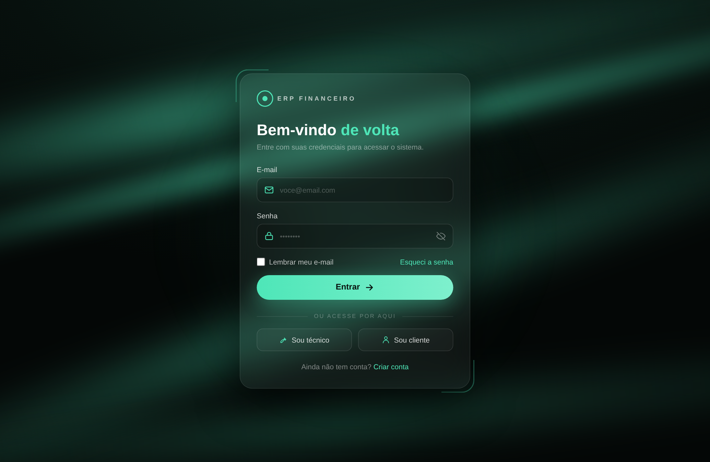

1. Abra o endereço do sistema e informe **e-mail e senha** do administrador.
2. Esqueceu a senha? Use "Recuperar senha" — chega um link no e-mail.
3. Por segurança, a sessão expira após 30 minutos sem uso.

## 2. Dashboard (visão geral)

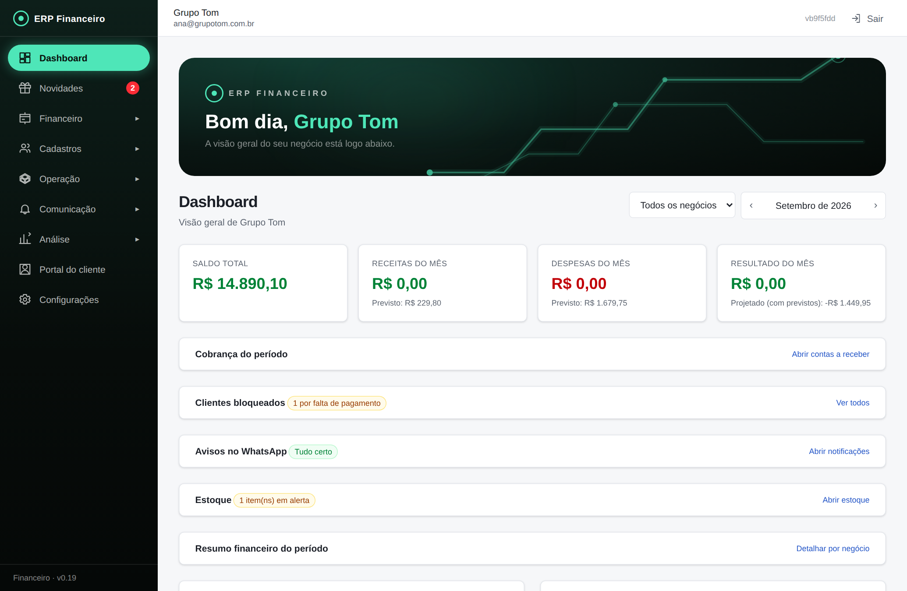

É a primeira tela. Mostra, para o mês escolhido no canto superior direito:

- **Cartões do topo**: saldo total das contas, receitas/despesas do mês (realizado e previsto) e resultado.
- **Avisos no WhatsApp**: se a régua de cobrança de cada negócio está em dia, com erro ou sem configuração.
- **Estoque**: itens zerados ou abaixo do mínimo.
- **Resumo financeiro do período**: saldo inicial, previsto × realizado e resultado.
- **Saldo por conta** e **últimas movimentações**.

Use o seletor "Todos os negócios" para filtrar tudo por um negócio (ex.: só Servnet).

> **Dica — organizar o menu:** os itens do menu lateral podem ser **arrastados** para a ordem que você preferir (segure e solte no lugar desejado). A ordem fica salva no navegador; em outro computador o menu volta ao padrão até você reordenar lá também.

> **Dica — cartões do dashboard:** os cartões (Avisos no WhatsApp, Estoque, Resumo financeiro, Saldo por conta, Últimas movimentações) começam **recolhidos**: clique em qualquer lugar da linha do título para expandir ou recolher. A escolha de cada cartão também fica salva no navegador.

## 3. Financeiro

O menu Financeiro tem quatro abas: **Lançamentos**, **Contas a receber**, **Contas a pagar** e **Cobrança**.

### 3.1 Lançamentos

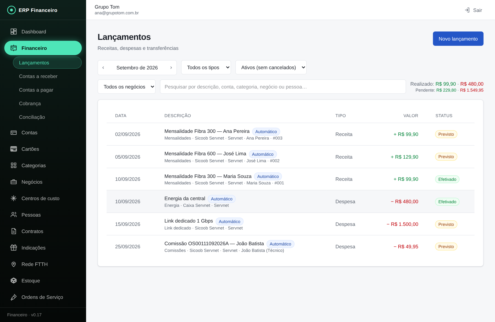

Todo o movimento do mês (receitas, despesas e transferências). Regras importantes:

- **Previsto** = ainda não aconteceu (conta a pagar/receber). **Efetivado** = dinheiro entrou/saiu de verdade.
- Para dar baixa: abra o lançamento → **Efetivar** → confirme a data e a conta (pode trocar a conta na hora da baixa; pagamento em atraso pode ter encargos).
- Lançamento pode ser **recorrente** (fixo ou parcelado): ao efetivar uma parcela, a próxima nasce sozinha.
- Mensalidades de contrato entram sozinhas (faturamento automático); meses futuros aparecem como **projeção** (não são gravados).

### 3.2 Contas a receber

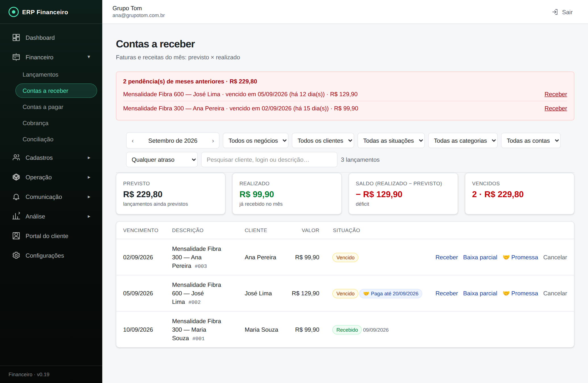

Só as receitas previstas do mês, com atrasadas destacadas. Pesquise pelo cliente e dê baixa direto no botão da linha.

### 3.3 Contas a pagar

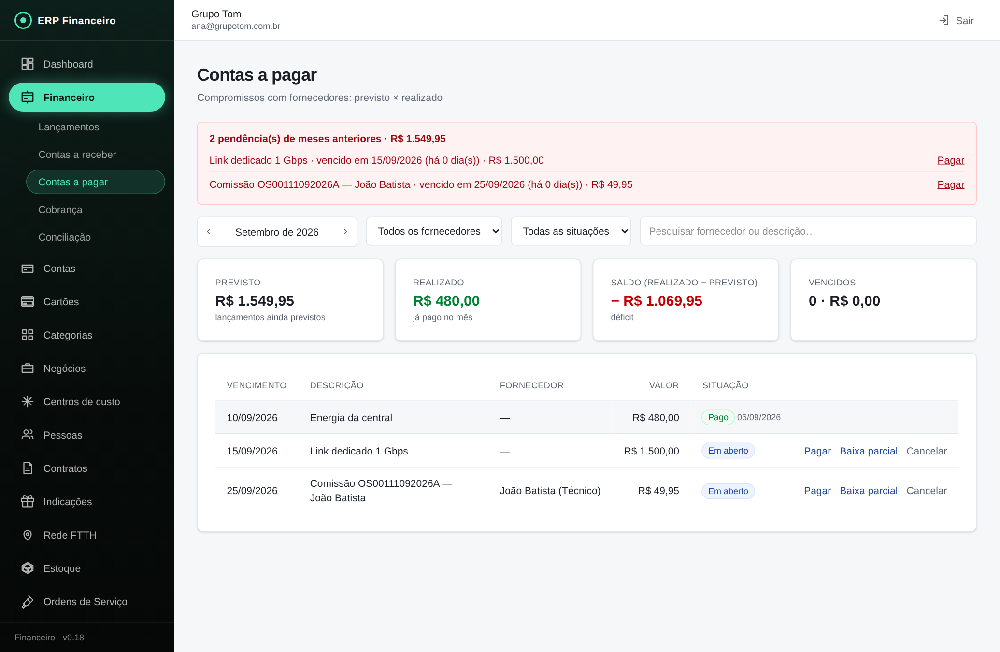

Mesma ideia para as despesas (energia, link, comissões dos técnicos etc.).

### 3.4 Cobrança (bloqueio assistido + Pix)

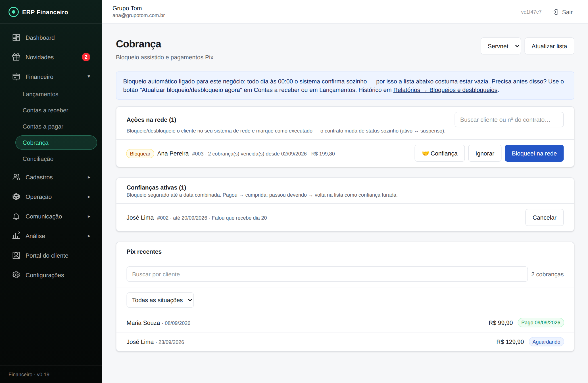

A tela monta sozinha a lista de **quem bloquear** (cobrança vencida além do prazo da régua) e **quem desbloquear** (suspenso que quitou):

1. Faça o bloqueio/desbloqueio no seu sistema de rede (OLT/ReceitaNet).
2. Clique **"Bloqueei na rede" / "Desbloqueei na rede"** — o contrato muda de status sozinho (ativo ↔ suspenso). "Ignorar" descarta a sugestão.
3. Embaixo, os **Pix recentes**: quem pagou pelo portal e quem está aguardando. O pagamento Pix dá baixa automática na fatura.

## 4. Contas

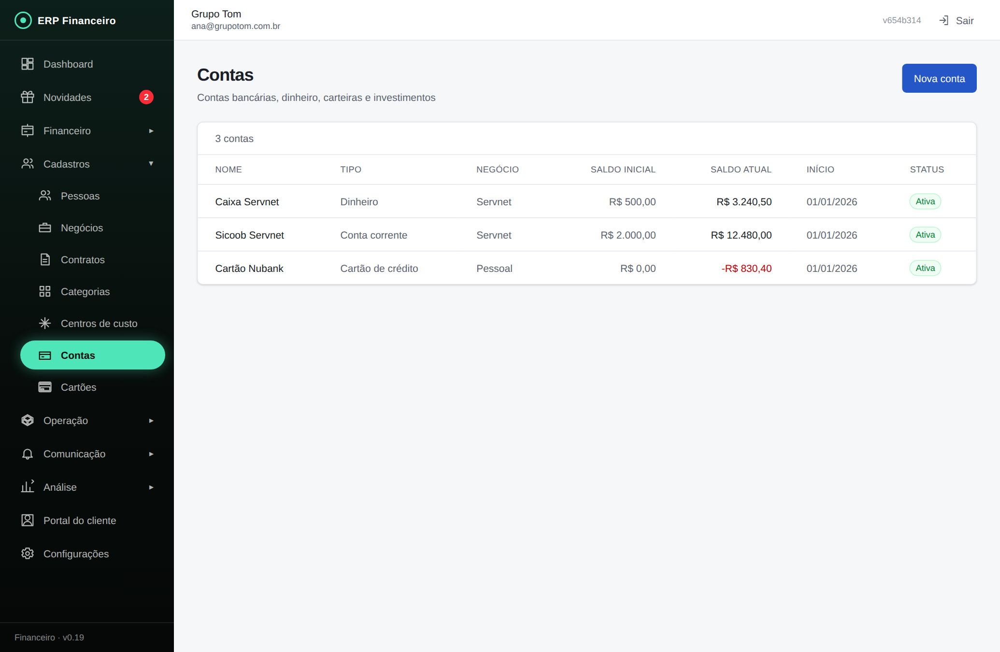

Cadastro das contas (caixa, banco, carteira digital, cartão). O **saldo é calculado** pelos lançamentos efetivados — nunca é digitado. Para acertar um saldo, use "Ajustar saldo" (gera um lançamento de ajuste).

## 5. Cartões de crédito

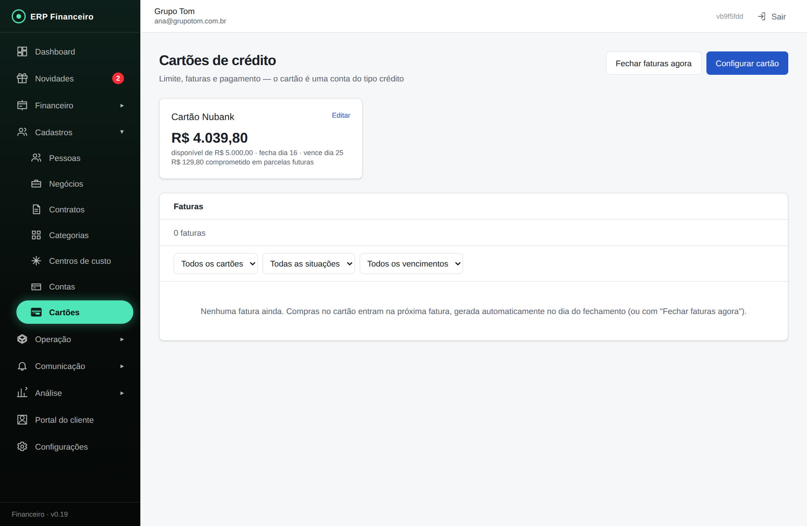

Cartão tem **fatura por mês**: as despesas no cartão entram como previstas na fatura; pagar a fatura é uma transferência da conta escolhida. Configure dia de fechamento e vencimento uma vez.

## 6. Categorias

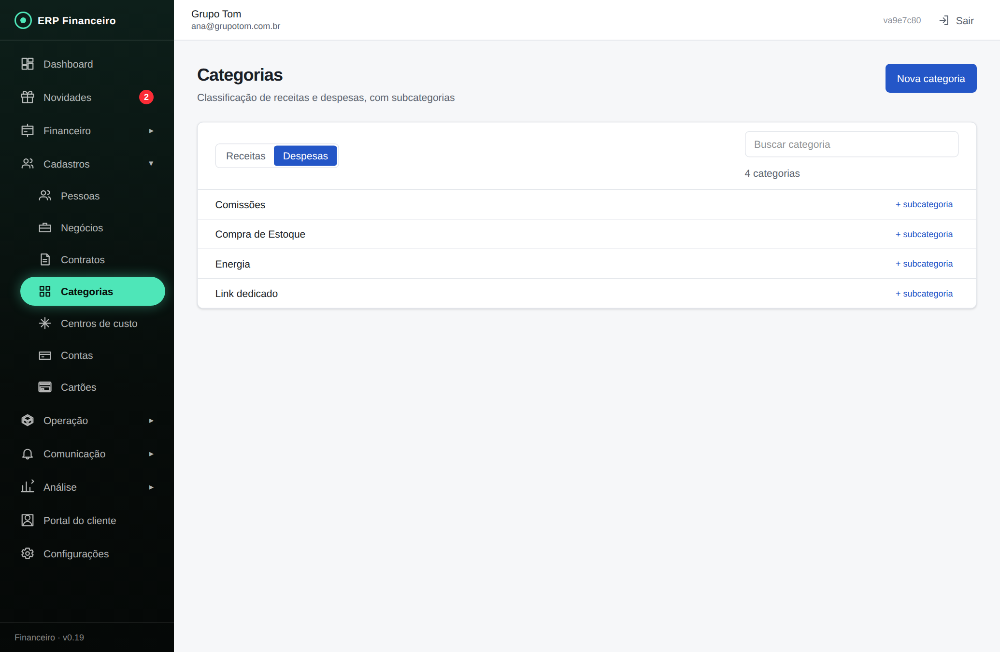

Categorias de receita e despesa usadas nos lançamentos e nos relatórios. Crie/renomeie/desative aqui (categoria usada não é excluída, só desativada).

## 7. Negócios

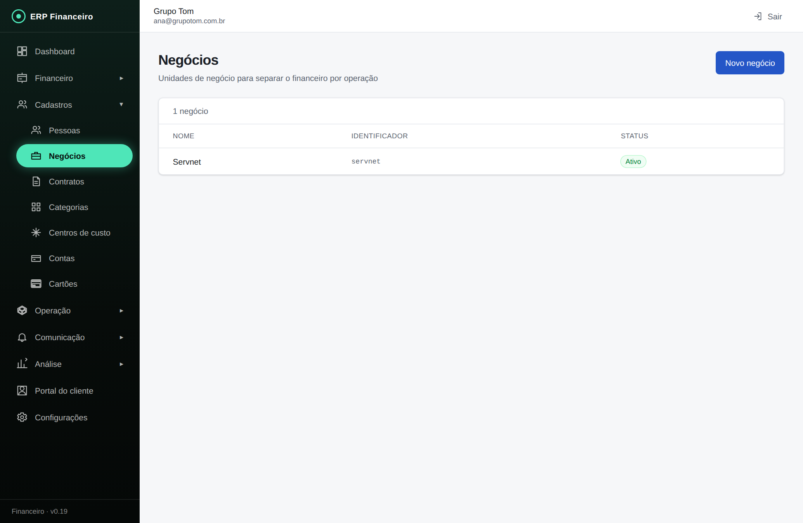

Cada operação sua (Servnet, etc.) é um **negócio**. Quase tudo no sistema é filtrável por negócio; contas e contratos pertencem a um negócio.

## 8. Pessoas

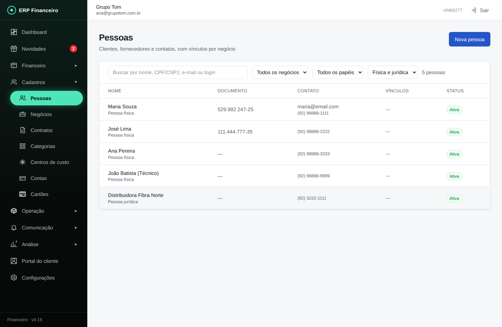

Cadastro único de clientes e fornecedores (o técnico também vira uma pessoa, para receber comissões). O **endereço** alimenta o mapa FTTH; **CPF + data de nascimento** são o login do cliente no portal; "receber avisos" controla o WhatsApp de cobrança.

## 9. Contratos

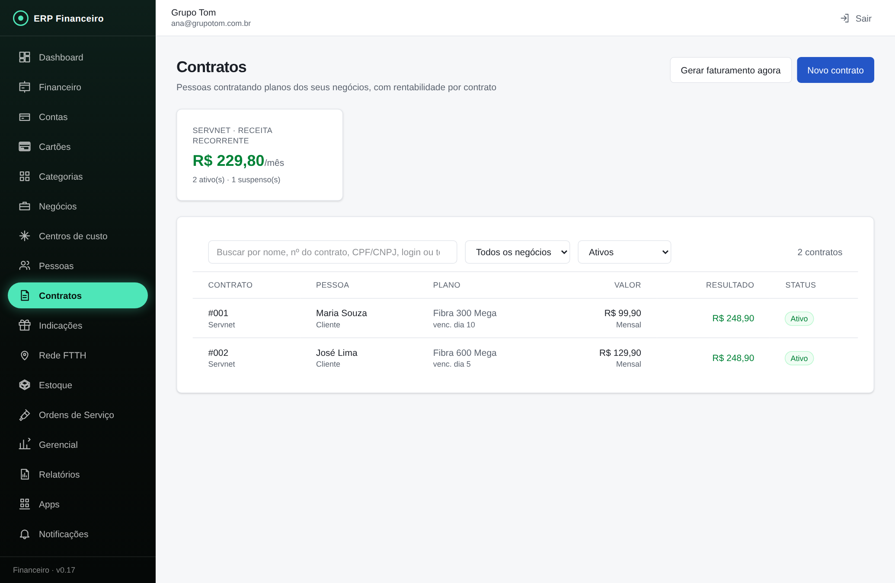

O coração da receita recorrente:

1. **Novo contrato**: cliente + plano + valor + dia de vencimento (+ conta de recebimento).
2. Com **faturamento automático**, a mensalidade entra sozinha todo mês em Contas a receber.
3. Clique no contrato para abrir o **detalhe**: rentabilidade, payback da instalação, custo de manutenção, equipamentos em comodato, aceite digital, alterar valor/vencimento, suspender ou encerrar.
4. Encerrar um contrato com equipamento na casa do cliente **gera sozinho uma OS de recolhimento**.

## 10. Rede FTTH (mapa)

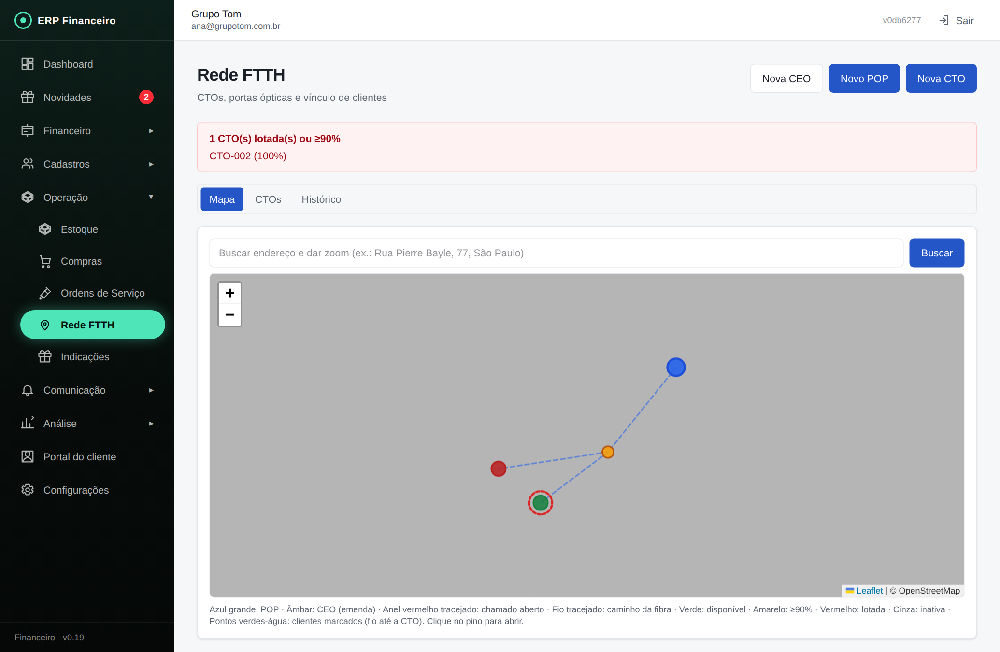

Mapa real da rede (OpenStreetMap):

- **Azul grande** = POP (central; guarda os dados da OLT: marca, modelo, IP, portas PON).
- **Âmbar** = CEO (caixa de emenda, com splitter primário).
- **Verde/amarelo/vermelho** = CTO por ocupação; **cinza** = inativa. **Anel vermelho tracejado** = chamado aberto naquele ponto.
- Fios tracejados seguem o caminho da fibra (POP → CEO → CTO); pontos verde-água são clientes com fio até a CTO.

Passo a passo comum:

1. **Nova CTO**: código sugerido, "Alimentado por" (POP ou CEO), portas/splitter e clique no mapa para marcar o local.
2. Clique numa CTO → **portas**: vincular cliente (contrato ativo), reservar, liberar, trocar de porta, marcar defeito, lacre por porta e da caixa.
3. Clique num POP/CEO → mostra **o que cai junto** num rompimento (pontos e clientes abaixo).
4. Se o monitoramento da OLT estiver ativo, um alerta vermelho aparece aqui quando a OLT não responde.

## 11. Estoque

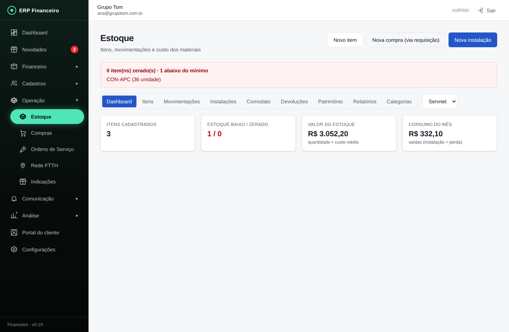

Estoque da Servnet com **custo médio ponderado** e movimentações imutáveis:

- **Itens**: o item nasce zerado; o saldo entra por **Ajuste de inventário** (define a quantidade que você tem) ou por **Nova compra**.
- **Nova compra**: vários itens + **pagamento misto** (parte no cartão → fatura; parte Pix/dinheiro → efetivado) — a despesa entra sozinha no Financeiro.
- **Movimentações**: histórico imutável (compra, instalação, devolução, ajuste, perda, transferência para a bolsa do técnico).
- **Instalações/Relatórios**: consumo por mês/origem e custo de instalação por contrato (payback).

### 11.1 Comodato (onde está cada ONU)

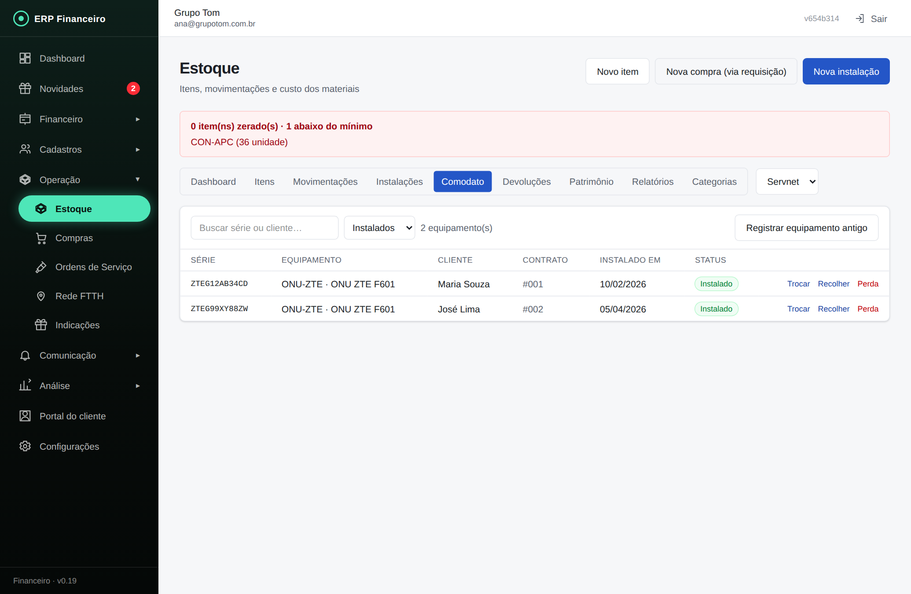

Cada equipamento entregue ao cliente tem **número de série** e status:

- Entra sozinho quando o técnico encerra uma OS informando a série.
- **Trocar** (queimou): informa a série nova (sai da bolsa do técnico); com "defeito de fábrica", o antigo não volta ao estoque.
- **Recolher**: volta ao estoque central (ou **descarte** com motivo).
- **Perda**: justificativa obrigatória. **Registrar equipamento antigo**: para o que já estava no cliente antes do sistema.

## 12. Ordens de Serviço (OS)

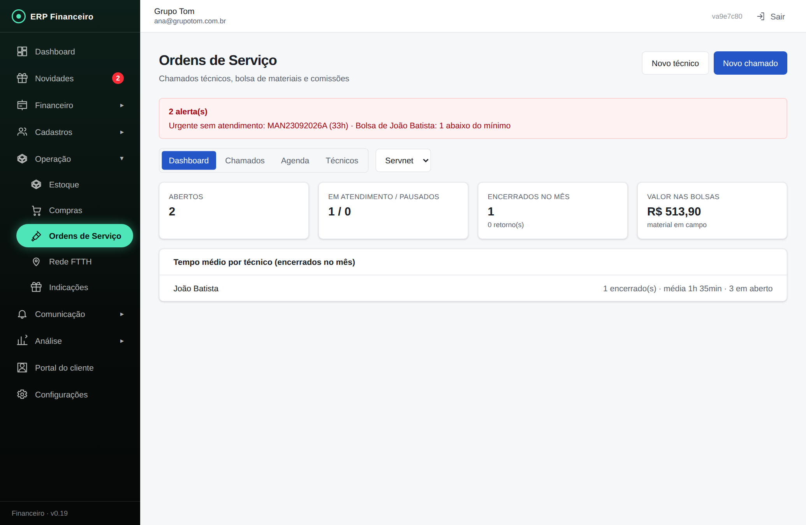

Chamados técnicos. O dashboard mostra abertos/em atendimento/encerrados, valor de material nas bolsas, tempo médio por técnico e **alertas** (urgente parado, pausado há 1 dia, bolsa negativa, pedido de reposição).

### 12.1 Chamados

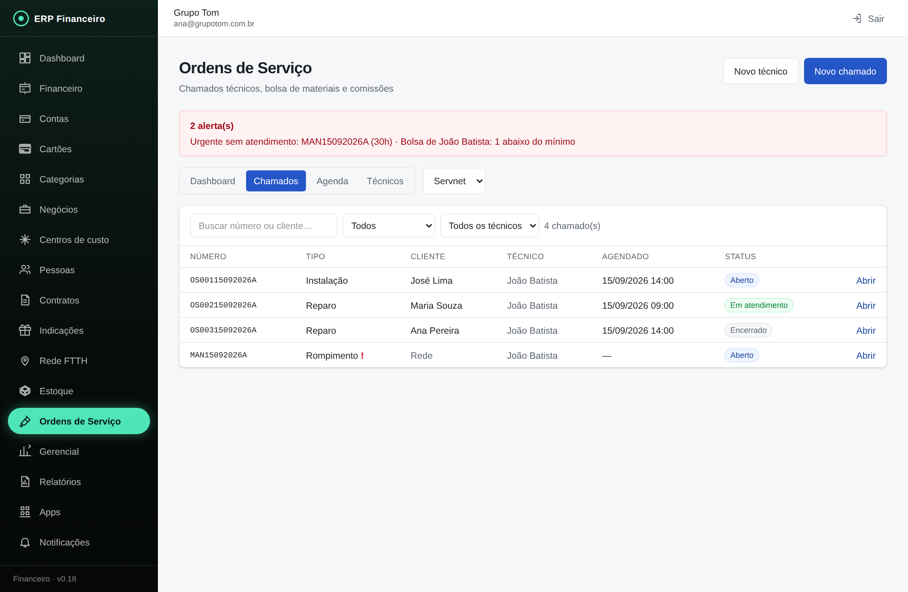

1. **Novo chamado**: tipo (instalação, manutenção, reparo, mudança, rompimento, vistoria, recolhimento), cliente/contrato (ou "rede", sem cliente), prioridade e CTO afetada. O técnico é atribuído sozinho.
2. Número automático: `OS{contrato}{data}{letra}` ou `MAN{data}{letra}` (sem contrato). Reabertura vira `-A`.
3. No detalhe: ciência → agendar (o **tempo conta do horário agendado**) → iniciar → pausar/retomar (motivo obrigatório) → **encerrar** com materiais, equipamentos (série), diagnóstico, sinal dBm e fotos.
4. Encerrado: **avaliar** (não resolvido → reabrir), **gerar comissão** (instalação/mudança; padrão 50% da mensalidade, editável — vira despesa prevista na categoria Comissões).
5. Remarcação pedida pelo técnico aparece para **quem abriu** aprovar (você ou o cliente no portal).

### 12.2 Agenda e Técnicos

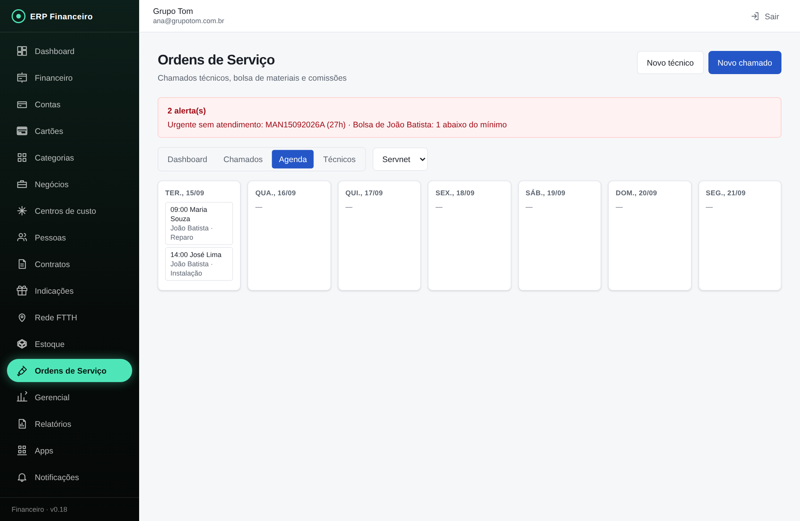

Agenda dos próximos 7 dias, por técnico e hora — confira antes de atribuir chamado novo.

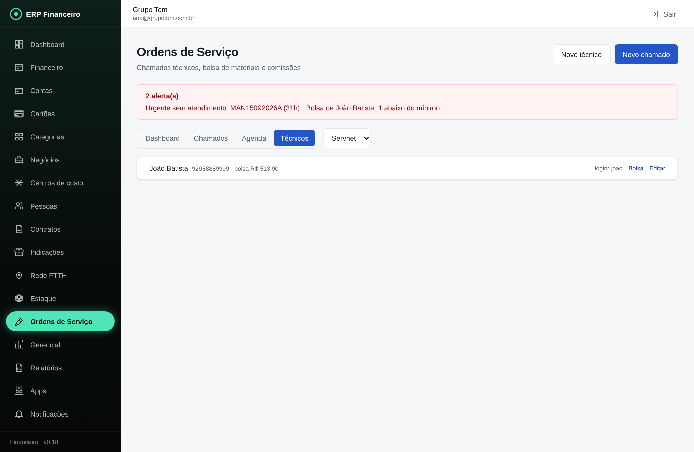

Cadastre o técnico (**Novo técnico**), depois **Criar login** (usuário e senha — ele entra em `/tecnico/entrar`). Em **Bolsa**: abastecer do estoque central, devolver, registrar perda/avaria e definir mínimos. Pedido de reposição do técnico aparece como alerta e some quando você abastece.

## 13. Gerencial (BI)

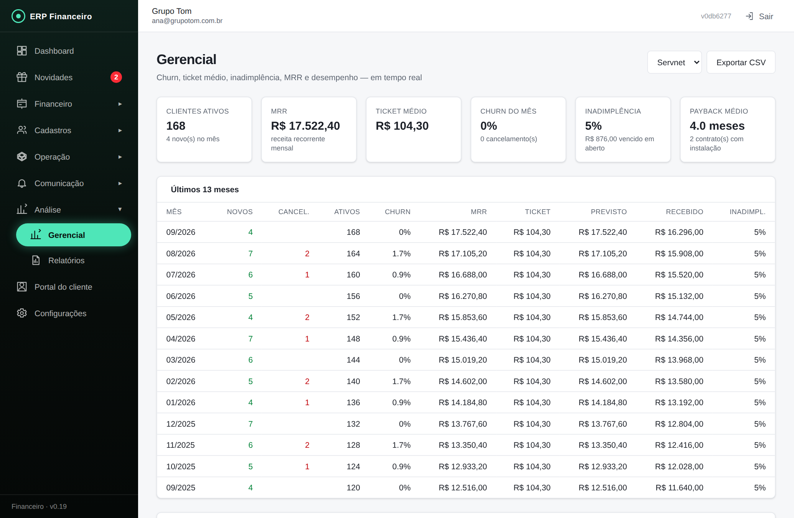

Indicadores em tempo real, por negócio: clientes ativos, **MRR**, ticket médio, **churn**, **inadimplência**, payback médio; tabela dos últimos 13 meses; desempenho por técnico (tempo, nota, retornos) e **Exportar CSV** (abre no Excel).

## 14. Apps / Notificações / Disparos

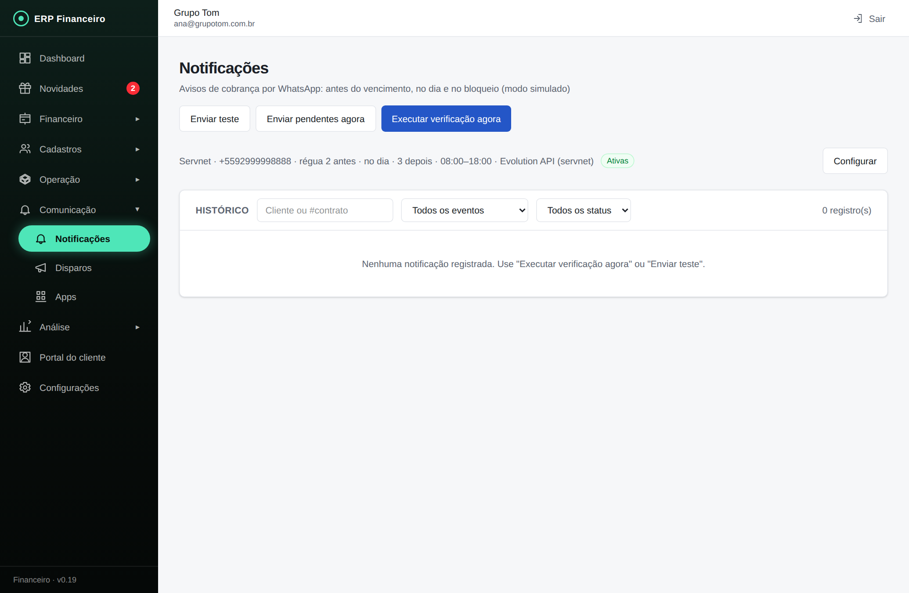

- **Notificações**: régua de cobrança no WhatsApp (D-3, no dia e D+3) por negócio — configure número, instância Evolution e templates; acompanhe o histórico de envio. Os avisos de OS (visita agendada/concluída) e o Pix copia-e-cola pegam carona nessa mesma configuração.
- **Disparos** (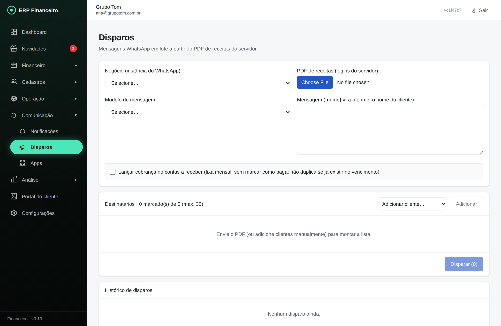): mensagens manuais em lote (ex.: aviso de manutenção) com proteção anti-bloqueio.
- **Apps**: controle de recargas/ativações de apps com carteira de dois saldos.

## 15. Portal do cliente (o que o seu cliente vê)

| Início | Faturas | Chamados | Meu plano |
|---|---|---|---|
| 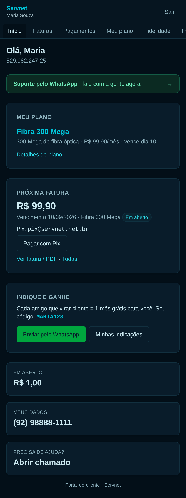 | 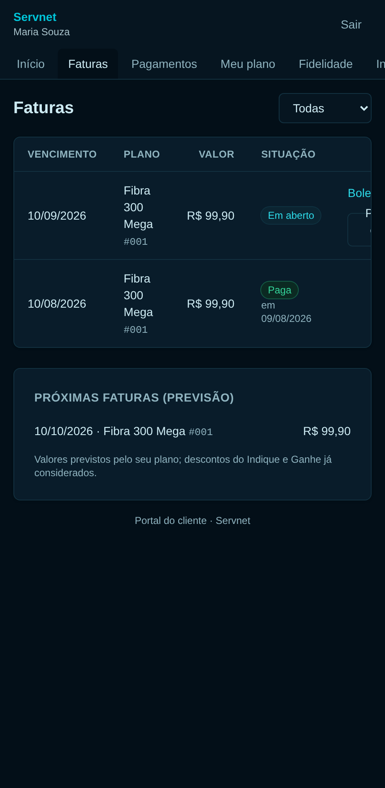 | 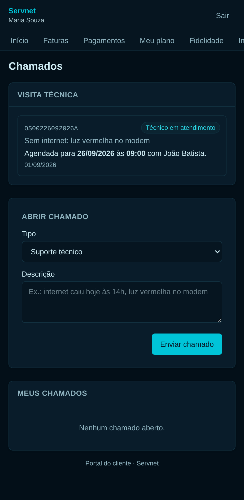 | 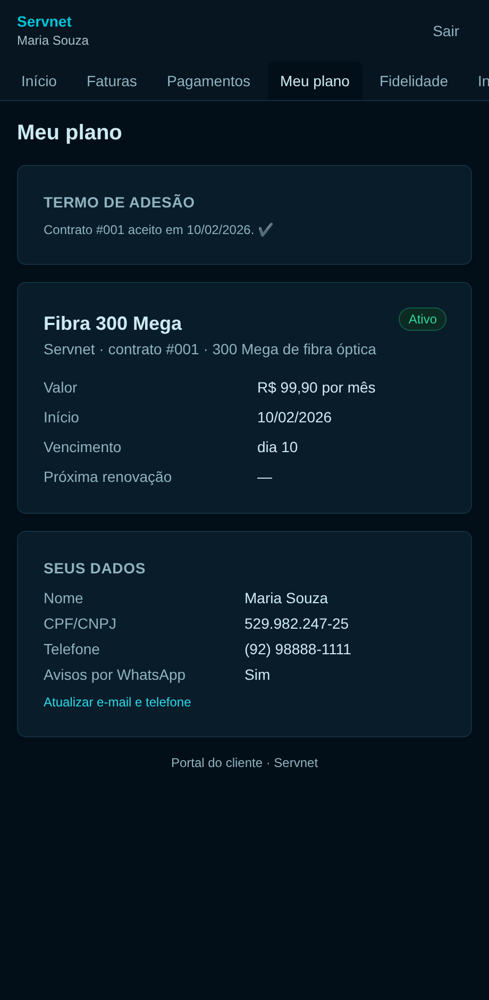 |

O cliente entra com **CPF + data de nascimento** e pode: ver e pagar faturas (**Pix copia-e-cola com baixa automática**), pedir **visita técnica** (vira OS de verdade), aprovar remarcação, avaliar o atendimento, acompanhar o cartão fidelidade, indicar amigos e **aceitar o contrato digitalmente** (fica registrado com data, IP e o texto exato).

Você configura a aparência e as regras em **Portal do cliente** (menu do admin): cores, chave Pix, Pix automático + conta que recebe, texto do termo de adesão, fidelidade, promoções e conversão de indicações.

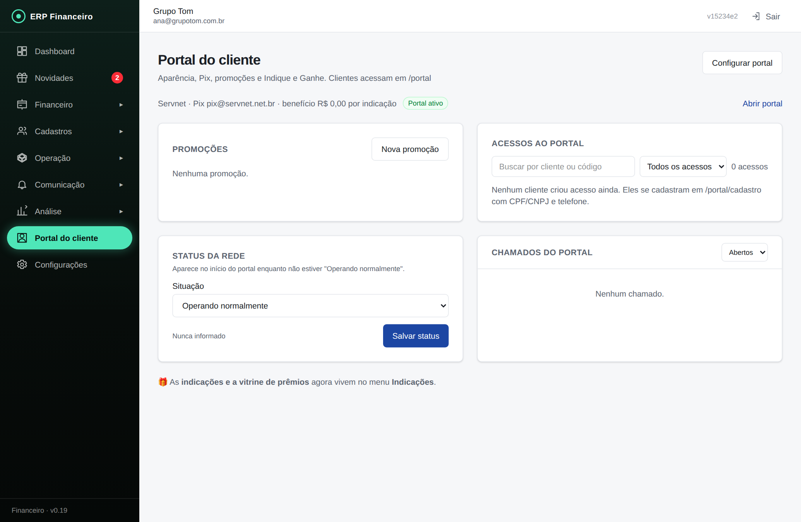

## 16. Área do técnico (o que o técnico vê)

| Login | Meus chamados | Minha bolsa |
|---|---|---|
| 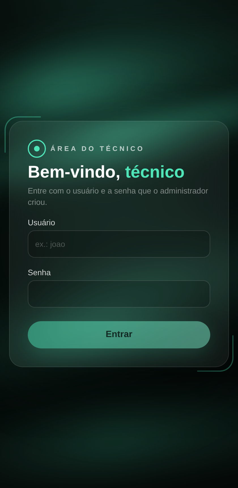 | 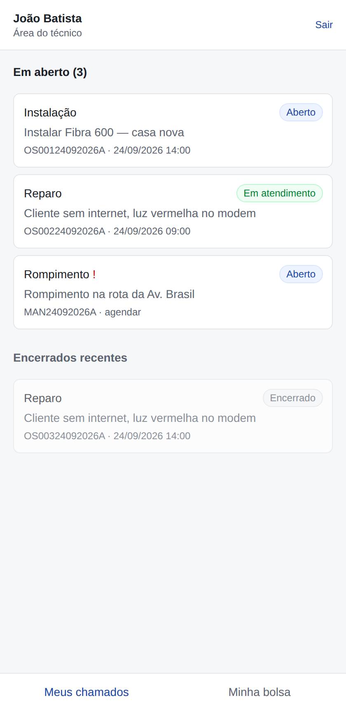 | 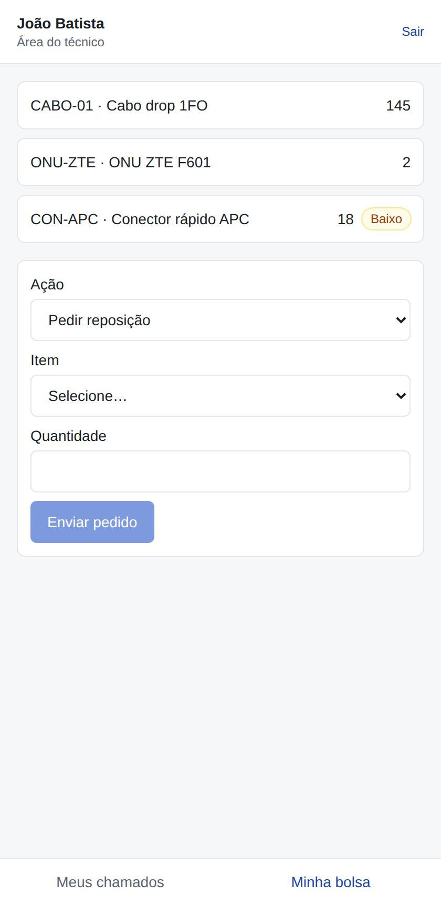 |

No celular, o técnico: dá ciência, **agenda a visita** (o cliente recebe no WhatsApp), inicia, pausa (com motivo), **encerra** informando materiais, série do equipamento, diagnóstico, sinal dBm e fotos. Na bolsa: saldo dos materiais, **pedir reposição** e registrar perda. Ele **não vê** tempos, financeiro nem outros clientes.

## 17. Configurações

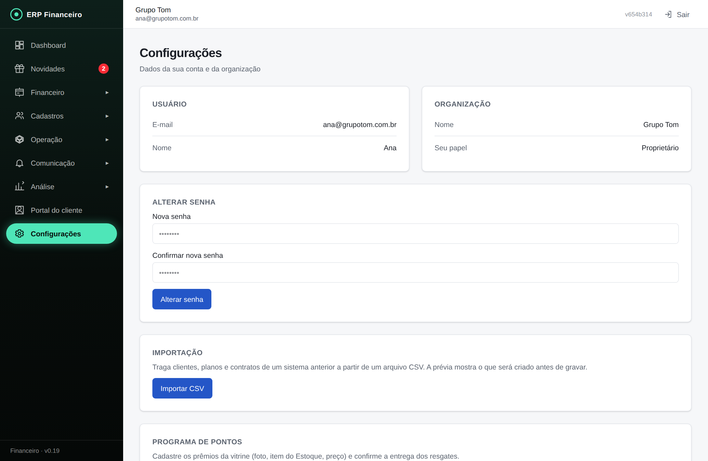

Dados da conta/organização e **Importar CSV** (traz clientes, planos e contratos de um sistema anterior, com prévia antes de gravar).

---

## Rotinas do dia a dia (resumo)

| Quando | O que fazer |
|---|---|
| Todo dia | Dashboard → alertas; Contas a receber → baixas do dia; OS → chamados novos |
| Cliente pagou | Baixa na linha (ou automática, se foi Pix pelo portal) |
| Cliente atrasou | Financeiro → Cobrança → bloquear na rede → "Bloqueei na rede" |
| Cliente novo | Pessoas → Contratos (novo) → OS de instalação → técnico instala e informa a série |
| Comprou material | Estoque → Nova compra (pagamento misto) → abastecer a bolsa do técnico |
| Fim do mês | Gerencial → conferir churn/inadimplência → Exportar CSV |
| Sempre | O backup roda sozinho todo domingo (GitHub → Actions → artifacts) |

## Como estes prints foram gerados

`app/scripts/prints-manual.mjs` sobe o app localmente com dados de demonstração (sem tocar a produção) e fotografa cada tela. Para atualizar o manual após mudanças de tela: `cd app && npm run build && node scripts/prints-manual.mjs`.
